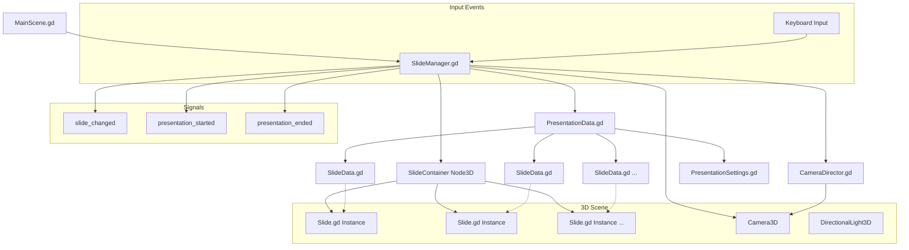

# Slide System Documentation

## Overview

The slide system in GDCV provides a 3D presentation framework built with Godot Engine. It allows creating and displaying slides in a 3D environment with camera transitions and animations.

## Architecture Diagram



## Core Components

### SlideManager (slide/SlideManager.gd)

Main controller for the presentation system:

- Manages slide collection and navigation
- Handles camera positioning and transitions
- Emits signals for presentation events
- Input handling for slide navigation

**Key Methods:**

- `load_presentation(data: PresentationData)` - Load slides from presentation data
- `start_presentation()` - Begin the presentation
- `next_slide()` / `previous_slide()` - Navigate between slides
- `go_to_slide(index: int)` - Jump to specific slide

**Signals:**

- `slide_changed(slide_index: int)` - Emitted when slide changes
- `presentation_started()` - Emitted when presentation begins
- `presentation_ended()` - Emitted when reaching end of presentation

### PresentationData (slide/PresentationData.gd)

Data container for presentation information:

- Title, author, and metadata
- Array of SlideData objects
- Presentation settings
- File loading/saving functionality

### SlideData (slide/SlideData.gd)

Individual slide configuration:

- Slide type (TEXT, IMAGE, MIXED)
- Content (title, text, image path)
- Visual properties (colors, fonts, positioning)
- 3D transformation data
- Transition settings

### Slide (slide/Slide.gd)

3D slide object implementation:

- Creates 3D geometry for slide content
- Handles visual rendering
- Animation and transition effects
- Visibility management

## Navigation Controls

- **Right Arrow / Down Arrow**: Next slide
- **Left Arrow / Up Arrow**: Previous slide
- **Enter**: Start/restart presentation

## Usage Example

```gdscript
# Create presentation data
var presentation = PresentationData.new()
presentation.title = "My Presentation"
presentation.author = "Author Name"

# Create slide
var slide = SlideData.new()
slide.type = SlideData.SlideType.TEXT
slide.title = "Slide Title"
slide.content = "Slide content"
slide.background_color = Color.BLUE

# Add slide to presentation
presentation.slides.append(slide)

# Load and start
slide_manager.load_presentation(presentation)
slide_manager.start_presentation()
```

## File Structure

```
slide/
├── MainScene.gd          # Main scene controller
├── SlideManager.gd       # Presentation manager
├── PresentationData.gd   # Presentation data model
├── SlideData.gd         # Individual slide data
├── Slide.gd             # 3D slide implementation
├── CameraDirector.gd    # Camera movement controller
├── PresentationSettings.gd # Settings configuration
├── VideoExporter.gd     # Export functionality
└── slide.tscn           # Main scene file
```

## Configuration

The main scene is configured in `project.godot`:

```
run/main_scene="res://slide/slide.tscn"
```

## Extending the System

To add new slide types:

1. Add enum value to `SlideData.SlideType`
2. Implement rendering logic in `Slide.gd`
3. Update UI components as needed

To add new transitions:

1. Modify `SlideData` transition properties
2. Implement animation in `Slide.gd` or `CameraDirector.gd`
